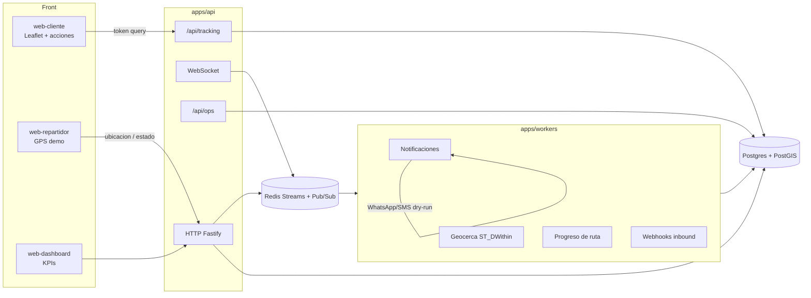

# Startup Logística — Anti-entregas fallidas

MVP event-driven para last mile B2B en España. El destinatario abre un enlace con `?token=`, ve al repartidor en un mapa Leaflet y confirma o reprograma; el backend registra logs, alertas y métricas (fallos evitados, dwell en geocerca) sin reescribir el motor PostGIS.

Stack: **Fastify + Redis Streams + PostgreSQL/PostGIS + Vite/React**. Monorepo con **pnpm 9** y **Node.js 20+**.

## Arquitectura



| Capa | Qué hace |
|---|---|
| Destinatario | SPA sin login. Lee **solo** `?token=` (nunca `localStorage`). Mapa Leaflet en poll 8s + **Estaré ahí** / **Reprogramar**. |
| Agencia / ops | API key `x-api-key`. Dashboard, tokens de parada, `/api/ops` (health, logs, métricas, checks). |
| Repartidor | Pings GPS, ruta de hoy, marcar entregado/ausente. Canal Redis en tiempo real. HTTP y WS exigen API key de agencia (`x-api-key`). |
| Workers | Consumer groups sobre streams: notificaciones (WhatsApp→SMS, quiet hours 22:00–08:00 Europe/Madrid, consentimiento por canal), geocerca, progreso de ruta, webhooks. |
| Shared | Tipos, FSM de paradas, contratos de tracking y ops. Subpaths: `@startup-logistica/shared/tracking` y `@startup-logistica/shared/ops`. |

### Monorepo

| Paquete | Rol |
|---|---|
| `packages/shared` | Tipos, streams, máquina de estados de `paradas`, tracking, ops |
| `apps/api` | HTTP + WebSocket + encolado. Tracking del destinatario y `/api/ops` |
| `apps/workers` | Consumer groups Redis: notificaciones (quiet hours + consentimiento), webhooks, geocerca `ST_DWithin`, progreso de ruta |
| `apps/web-cliente` | SPA Vite + React + Leaflet (`?token=`) |
| `apps/web-repartidor` | Simulador GPS / WS (puerto 5174) |
| `apps/web-dashboard` | Vista de KPIs (puerto 5175) |
| `infra/postgres` | Schema, seed Madrid, analytics y migración ops (`04-ops.sql`) |

## Requisitos

- Node.js **20+**
- pnpm **9** (`packageManager`: `pnpm@9.12.0`)
- Docker (Postgres PostGIS 16 + Redis 7)

## Entorno local

```bash
# Linux / macOS
cp .env.example .env

# Windows
copy .env.example .env

docker compose up -d
pnpm install
```

Levanta los procesos (en terminales distintas, o `pnpm dev` para todos en paralelo):

```bash
pnpm dev:api
pnpm dev:workers
pnpm dev:web
pnpm dev:repartidor
pnpm dev:dashboard   # opcional
```

| Servicio | URL |
|---|---|
| API health | http://localhost:3000/health |
| Ops health | http://localhost:3000/api/ops/health |
| Web cliente | http://localhost:5173/?token=… |
| App repartidor | http://localhost:5174 |
| Dashboard | http://localhost:5175 |

`docker compose` publica Postgres en `5432` y Redis en `6379`. El init monta `infra/postgres/` (schema + seed + ops). API y workers vuelven a aplicar `04-ops.sql` al arrancar (idempotente).

Variables relevantes (ver `.env.example`):

| Variable | Uso |
|---|---|
| `DATABASE_URL` / `REDIS_URL` | Postgres y Redis |
| `JWT_MASTER_SECRET` | Firma de tokens de destinatario (HMAC por agencia) |
| `PUBLIC_WEB_URL` | Base del enlace que recibe el cliente |
| `VITE_API_URL` | Origen de la API para el SPA (por defecto `http://localhost:3000`; en dev Vite también hace proxy de `/api`) |
| `OPS_TOKEN` | Auth alternativa a la API key para cron de ops (`x-ops-token`) |
| `OPS_CHECKS_INTERVAL_MS` | Periodo del evaluador de alertas (0 lo desactiva; por defecto 120s) |
| Twilio / Meta / FCM / R2 | Opcionales. Sin Twilio las notificaciones van en **dry-run** (consola + `eventos_notificacion` / `notification_jobs`) |
| `NOTIFICATION_RETRY_POLL_MS` | Poll del worker para jobs aplazados por quiet hours (por defecto 30s; `0` lo desactiva) |

## Pruebas

Quiet hours / consentimiento (shared + workers) **no necesitan VPS, Postgres ni Redis**:

```bash
pnpm --filter @startup-logistica/shared test
pnpm --filter @startup-logistica/workers test
```

El resto del workspace, con Postgres y Redis arriba (`docker compose up -d`):

```bash
pnpm test
```

Eso ejecuta `pnpm -r --if-present run test` en el workspace:

| Paquete | Qué cubre |
|---|---|
| `packages/shared` | Quiet hours Europe/Madrid 22:00–08:00, consentimiento y fallback WA→SMS (`notification-policy.test.ts`). **No necesita VPS, Postgres ni Redis.** |
| `apps/workers` | `planForParada` (aplazar WA/SMS de noche, push, skip sin consentimiento) y backoff de `RESUME_ERROR` 30s→2m→10m / `failed` al 4.º (`notifications-plan.test.ts`, `resume-backoff.test.ts`). **No necesita VPS.** |
| `apps/api` | Unitarias del gate de token (`tracking-gate.test.ts`), auth HTTP/WS de repartidor (`auth-repartidor.test.ts`, `ws/auth.test.ts`) e **integrales** de ops contra PostGIS (`ops.test.ts`: logs con `correlation_id`, alertas idempotentes, métricas de failure avoided y dwell) |
| `apps/web-cliente` | Cliente HTTP de tracking, 410 `gone`, y que **Estaré ahí** / **Reprogramar** llaman a endpoints distintos |

Otros comandos:

```bash
pnpm typecheck
pnpm build
pnpm ops:checks          # evalúa alertas ahora (API key u OPS_TOKEN)
```

Las integrales de ops fallan si Postgres no está escuchando en `DATABASE_URL`.

## Módulo web-cliente (Leaflet + acciones)

SPA en `apps/web-cliente`. El token **solo** sale de `searchParams` (`?token=`).

### Gate

| HTTP | UI |
|---|---|
| 200 | Mapa + panel (o solo banner si la sesión ya está confirmada/reprogramada) |
| 410 `{ error: "gone", reason: "expired" \| "used" }` | `TokenErrorView`: sin mapa ni botones |
| 401 / 404 | Enlace inválido |

### Acciones

| Botón | Endpoint | Efecto |
|---|---|---|
| **Estaré ahí** | `POST /api/tracking/confirm-presence` `{ token }` | `will_be_there`. Spinner + botones disabled (sin doble submit) |
| **Reprogramar** | `POST /api/tracking/reschedule` `{ token, preferred_window? }` | `reschedule_requested`. **No** llama a confirm-presence |

Tras éxito se oculta `ActionPanel`, se muestra `StatusBanner` y **el mapa sigue montado** (el poll de posición continúa). Leaflet se carga en diferido (`React.lazy`), equivalente a `dynamic(..., { ssr: false })`.

Marcadores: entrega (fijo) y courier (vivo). `fitBounds` solo en la carga inicial.

### API de tracking

| Método | Ruta | Respuesta |
|---|---|---|
| GET | `/api/tracking/session?token=` | Sesión + punto de entrega |
| GET | `/api/tracking/position?token=` | `{ lat, lng, updatedAt }` (poll ~8s) |
| POST | `/api/tracking/confirm-presence` | `{ ok, status: "will_be_there" }` |
| POST | `/api/tracking/reschedule` | `{ ok, status: "reschedule_requested" }` |

Los 410 de tracking se registran en ops con **prefijo/hash del token**, nunca el JWT en claro.

Compatibilidad: siguen existiendo `/cliente/parada`, `/cliente/confirm-presence` y `/cliente/reschedule`.

Estructura del front: `page.tsx`, `TrackingShell`, `TrackingMap`, `ActionPanel`, `StatusBanner`, `TokenErrorView`, hooks `useTrackingToken` / `useCourierPositions` / `useRecipientActions`, `lib/tracking-api.ts`, `types/tracking.ts`.

## Notificaciones (worker)

El consumer de `stream:notifications` persiste cada intento en `notification_jobs` y aplica, en este orden:

1. **Consentimiento** (`paradas.consent_whatsapp` / `consent_sms` / `consent_push`). `NULL` o `false` = no consta. Ese canal se marca `skipped`; si el siguiente de la cadena **WhatsApp → SMS** tiene consentimiento y está disponible, se usa (un solo envío, no los dos).
2. **Canal disponible** (teléfono / token push / `TWILIO_*`). Si Twilio está configurado pero falta `TWILIO_SMS_FROM`, SMS no se usa.
3. **Quiet hours** `Europe/Madrid` **22:00–08:00**: WhatsApp, SMS y llamada se aplazan (`status=pending`, `error_code=QUIET_HOURS`, `next_retry_at` = próximas 08:00). **Push (`app`) sí se envía.** No se hace fallback WA→SMS de noche para no despertar. El worker reanuda jobs aplazados con un poll (`NOTIFICATION_RETRY_POLL_MS`, 30s). Hasta que no hay envío real la parada **no** pasa a `notificado`. Un `RESUME_ERROR` no deja el job en `pending` con `next_retry_at` ya vencido: backoff **30s → 2m → 10m** y `failed` al cuarto intento.

`POST /agencia/rutas/:rutaId/paradas` acepta `consent_whatsapp`, `consent_sms` y `consent_push` opcionales. Las paradas seed de demo tienen consentimiento a `true`.

## Módulo ops (logs, alertas, métricas)

Instrumentación en API y workers. Tablas: `ops_logs`, `ops_alerts`, `notification_jobs` (más columnas de dwell / failure avoided en `delivery_attempts`).

### Logs

Cada request lleva `X-Correlation-Id` (se genera si falta). Categorías: `webhook`, `delivery_status`, `notification_fallback`, `geofence`, `tracking_token`, `system`. Payloads sensibles (`token`, `authorization`, …) se sustituyen por huella.

### Alertas

`evaluateOpsAlerts()` / `runOpsChecks()` (cron interno o `POST /api/ops/checks`). Idempotentes: no abren otra alerta `open` con el mismo `code + dedupe_key`.

| Código | Significado |
|---|---|
| `BG_JOB_STUCK` | Job de notificación colgado |
| `BG_JOB_FAIL_RATE` | Tasa de fallo alta |
| `FALLBACK_CHAIN_EXHAUSTED` | Cadena WhatsApp→SMS agotada |
| `CLIENT_RESPONSE_DELAY` | Destinatario notificado sin respuesta |
| `WEBHOOK_ERROR_SPIKE` | Pico de errores de webhook |
| `DWELL_ANOMALY` | Permanencia anómala en geocerca |

### Métricas

`GET /api/ops/metrics?from=&to=` expone system, **failureAvoided**, **dwell** y notificaciones. El dashboard reutiliza `failedDeliveriesAvoided`, `avgGeofenceDwellSeconds` e `inGeofenceNow`.

| Método | Ruta | Auth |
|---|---|---|
| GET | `/api/ops/health` | Pública. `{ ok, openCriticalAlerts, stuckJobs }` |
| GET | `/api/ops/metrics` | `x-api-key` o `x-ops-token` |
| GET | `/api/ops/logs?category=&orderId=&limit=` | Igual (límite 100) |
| POST | `/api/ops/checks` | Igual. Evalúa y persiste alertas |

```bash
curl -s http://localhost:3000/api/ops/health
curl -s -H "x-api-key: demo-api-key" http://localhost:3000/api/ops/metrics
curl -s -X POST -H "x-api-key: demo-api-key" http://localhost:3000/api/ops/checks
```

## Demo

API key de la agencia seed: `demo-api-key`.

Enlace del destinatario para una parada:

```bash
curl -X POST http://localhost:3000/agencia/paradas/55555555-5555-5555-5555-555555555554/token \
  -H "x-api-key: demo-api-key"
```

Abre la `url` que devuelve (`/?token=…`). En la app del repartidor, cargar `repartidor_001` (API key `demo-api-key`) y pulsar el ping GPS dispara geocerca. Completar paradas dispara **progreso de ruta**: si faltan exactamente 3, el worker encola WhatsApp (dry-run si no hay Twilio).

Parada seed de Santiago Demo: `55555555-5555-5555-5555-555555555554` (Templo de Debod).

## Despliegue a producción

Archivos en el repo (rama de trabajo, no sustituyen el compose local):

| Archivo | Uso |
|---|---|
| `apps/api/Dockerfile` | API Fastify |
| `apps/workers/Dockerfile` | Consumers Redis |
| `apps/web-cliente/Dockerfile` | Build Vite + nginx unprivileged (`USER 101`, :8080, `COPY --chown=101:101` del `dist`) |
| `docker-compose.prod.yml` | PostGIS + Redis internos, Caddy en 80/443 |
| `docker-compose.prod.local.yml` | Overlay local: `Caddyfile.local` + `localhost` / `api.localhost` |
| `Caddyfile` | TLS ACME de producción |
| `Caddyfile.local` | `tls internal` para HTTPS local (no usar en el VPS) |
| `.env.production.example` | Plantilla de secretos (no commitear valores reales) |
| `.env.production.local.example` | Dummy local; copiar a `.env.production.local` (gitignored) |
| `deploy/LOCAL_HTTPS.md` | Smoke HTTPS local sin Let's Encrypt |
| `deploy/SECURITY_CHECKLIST.md` | Checklist de endurecimiento |
| `deploy/MERGE_ORDER.md` | Orden #4→#11, #9 rebaseado sobre #11, qué verifica Grey, VPS ≠ código |
| `deploy/DEPLOY_PLAN_MANANA.md` | Pasos de go-live |
| `deploy/BACKUP_RESTORE.md` | Backup/restore PostGIS: frecuencia, retención, dry-run en staging |
| `deploy/STAGING_SMOKE.md` | Smoke E2E de staging **antes de DNS público** (geocerca, dry-run, confirm-presence, métricas, `PLAN=1`) |
| `scripts/prod-healthcheck.sh` | Smoke `/health`, ops y SPA; E2E opcional con `STAGING_BASE` + `STAGING_SMOKE=1` |
| `scripts/backup-postgres.sh` | `pg_dump` con timestamp (`.env.production`) |
| `scripts/restore-postgres.sh` | Restore destructivo (`CONFIRM=yes`) |

```bash
cp .env.production.example .env.production
# editar secretos, dominios y DATABASE_URL / REDIS_URL
docker compose -f docker-compose.prod.yml --env-file .env.production up -d --build
./scripts/prod-healthcheck.sh https://api.rutacerca.es https://seguimiento.rutacerca.es
```

Smoke staging **antes de DNS público** (compose local, Twilio vacío, sin ACME): `deploy/STAGING_SMOKE.md`.

```bash
STAGING_BASE=http://localhost:3000 STAGING_SMOKE=1 AGENCY_API_KEY=demo-api-key \
  ./scripts/prod-healthcheck.sh
```

Postgres de prod **no** carga `02-seed.sql`. Crea la agencia y el `api_key_hash` a mano. DNS A/AAAA de `SITE_TRACKING` y `SITE_API` al VPS; Caddy saca certificados con `ACME_EMAIL`. PostGIS/Redis solo en red `internal`; la API está en `edge`+`internal`. `/ws/repartidor` y HTTP `/repartidor/*` exigen API key de agencia (`x-api-key`; el WS también acepta mensaje `auth`).

HTTPS **en local** (sin ACME, `tls internal`): `deploy/LOCAL_HTTPS.md`. El overlay `docker-compose.prod.local.yml` no se usa en el VPS.
